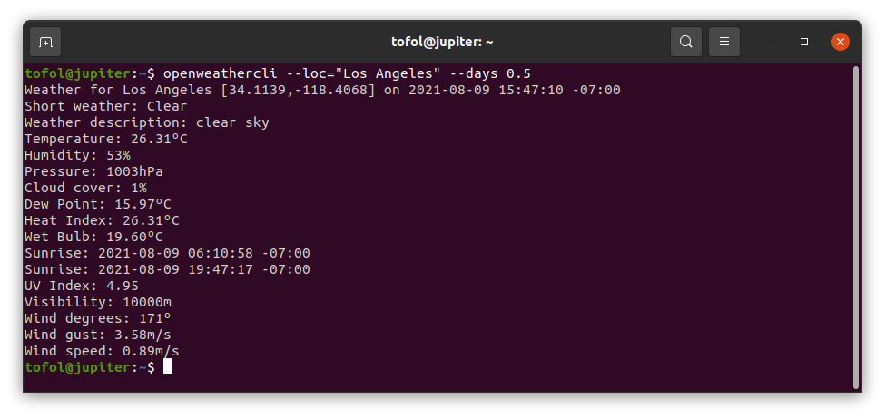
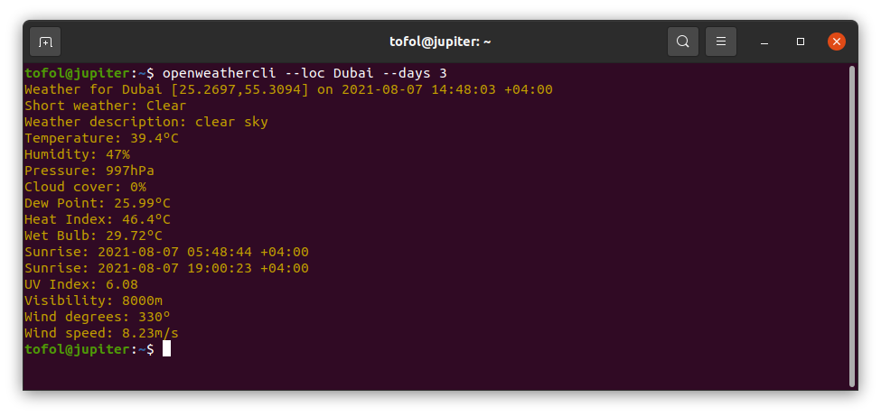
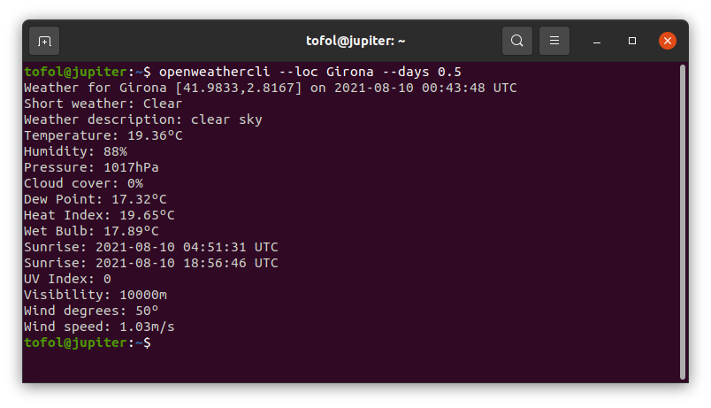
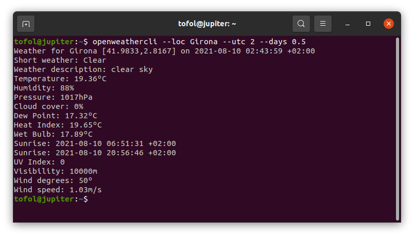
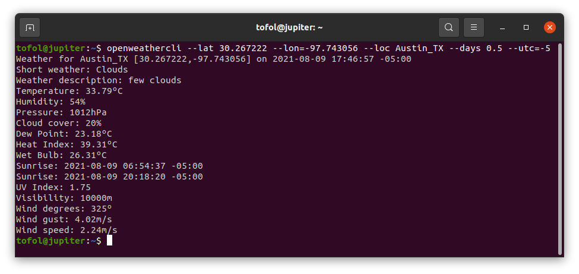

# openweathercli
A small cli app using the [openweathermap fork](https://github.com/Dr-Kristau/openweathermap)

Usage:

Automatic
---------
```bash
openweathercli --loc="Los Angeles" --days 0.5 --api_key <MY_API_KEY>
```

Using worldcities.csv from [simplemaps](https://simplemaps.com/data/world-cities) for latitude and longitude, and timezone.csv from [timezonedb](https://timezonedb.com/download) for UTC offsets, most big cities can be found automatically using only `--loc` and `--days`.

In the screenshot below the `--api_key` has been defined by default in the code:


The wet-bulb temperature color code the text for risk, as documented in [simple_wet_bulb](https://github.com/Dr-Kristau/simple_wet_bulb).


To count in hours rather than fractions of days, we can use:
```bash
openweathercli --loc="Los Angeles" --days=$(bc -l <<< '12/24') --api_key <MY_API_KEY>
```

Semi-Automatic
---------
Given that worldcities.csv has a more extensive collection of municipalities than timezone.csv, there are a number of municipalities with no corresponding timezone, which results in output in UTC.
```bash
openweathercli --loc Girona --days 0.5 --api_key <MY_API_KEY>
```
In the screenshot below the `--api_key` has been defined by default in the code:


You can resolve the timezone by specifying a value for `--utc`.
```bash
openweathercli --loc Girona --utc 2 --days 0.5 --api_key <MY_API_KEY>
```
In the screenshot below the `--api_key` has been defined by default in the code:



Manual
------
```bash
openweathercli --lat 30.267222 --lon=-97.743056 --loc Austin_TX --days 0.5 --utc=-5 --api_key <MY_API_KEY>
```
Where:
- `--lat` `--lon` = latitude and longitude in decimal format
- `--loc` = [optional] location label 
- `--days` = number of decimal days between zero and five to subtract from present time
- `--utc`= [optional] offset from UTC, otherwise time displayed in UTC
- `--api_key` = the OpenWeather API key

In the screenshot below the `--api_key` has been defined by default in the code:

